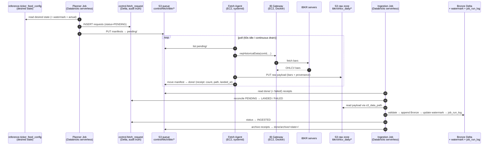

# End-to-End Ingestion Workflow — Two-Plane Architecture

**Scope:** the complete lifecycle of one ingestion request, from planning to Bronze.
Audience: developers and operations. Companion docs:
[fetch_agent_runbook.md](../runbooks/fetch_agent_runbook.md) (ops commands),
[systemd_service_guide.md](../runbooks/systemd_service_guide.md) (service model),
CLAUDE.md §14 (architecture decision record).
**Status note:** Stages 1–3 are built and validated; Stage 4 (Raw→Bronze job) is
in build (Chunk 3). Bronze tables are standard Delta tables written by jobs
(not DLT pipelines).
**Last updated:** 2026-07-05

---

## 1. The picture



## 2. Step-by-step

| # | Step | Trigger | Component / Where | Input → Output |
|---|---|---|---|---|
| 1 | **Plan** | Schedule (7pm ET Mon–Fri; manual today) | `FetchPlannerJob`, Databricks serverless | ticker_feed_config (desired) + ingestion_watermark (actual) + instrument/listing/vendor_id enrichment → derived load type & date range per instrument |
| 2 | **Enqueue** | Same run | Planner | → `fetch_request` rows (PENDING) + one Contract-v2 manifest per chunk in `control/fetch/ibkr/pending/`. Chunking: 365d (backfill) / 30d (incremental). Policy: no vendor_instrument_id → skipped_unmapped, never emitted |
| 3 | **Fetch & land** | Agent poll finds manifests | Fetch agent (EC2 host process) + IB Gateway (Docker) + IBKR | manifest → bars via conId (`Contract(conId=…)`, no symbol lookups) → raw JSON payload (bars + full provenance) to `land_to` path → manifest moved to `done/` enriched with `record_count`, `s3_data_path`, `landed_at` |
| 4 | **Reconcile & ingest** *(Chunk 3)* | Scheduled / file-arrival / manual | `RawToBronzeJob`, Databricks serverless | done/failed receipts → fetch_request LANDED/FAILED; payload bars → DataQualityValidator (17 rules, audit stamping) → BronzeWriter (dedup-classify, append-only) → watermark upsert → job_run_log row → fetch_request INGESTED → receipts archived |

**Data flow media:** Databricks→agent = S3 manifests (only channel; serverless has
zero egress). Agent→Databricks = S3 files (raw payloads + receipts). Truth for
humans/SQL = Delta control tables. The agent never touches Delta; Databricks
never opens a network connection.

## 3. State machine (`control.fetch_request.status`)

```
            planner                agent                    ingestion job
  (none) ────────────► PENDING ────────────► [receipt in done/] ─► LANDED ─► INGESTED
                          │                                             (terminal ✓)
                          │ agent exhausts retries / bad contract
                          └────────────► [manifest in failed/] ──► FAILED
                                                                  (terminal ✗ — next
                                                                   planner run re-plans
                                                                   uncovered dates)
```
S3 mirror: `pending/` = PENDING · `done/` = LANDED (awaiting reconcile) ·
`failed/` = FAILED · `done/archive/` = INGESTED.

## 4. Failure scenarios by stage

| Stage | Failure | Detection | Handling / Recovery | Manual action? |
|---|---|---|---|---|
| Plan | Unmapped instrument | `skipped_unmapped` in summary + warning log | Blocked by `require_vendor_id` policy — no bad fetch possible | Run `06_seed_vendor_ids` notebook, re-run planner |
| Plan | Planner crashes mid-write | Delta rows without manifests → stuck PENDING | Monitor flags stuck PENDING; re-run planner (idempotent: in-flight instruments skipped, missing manifests re-emitted on re-plan) | Re-run planner |
| Enqueue | Duplicate emission attempt | `skipped_inflight` in summary | Planner skips instruments with PENDING/LANDED requests | None |
| Fetch | IBKR error / pacing / no data | Agent retries ×3 with backoff, then manifest → `failed/` with error_message | Transient: next planner run re-plans (watermark didn't advance). Persistent: triage per runbook §6.6 | Only for persistent errors |
| Fetch | Gateway down / nightly restart | Agent logs "gateway is down — waiting"; work stays in pending/ | Auto-resume when port returns; Docker `restart:always` revives container | None |
| Fetch | Agent process dies | systemd restart (15s); heartbeat absent >1h = alarm signal | Manifest being processed is re-processed on restart (at-least-once; dedup makes replay harmless) | None |
| Fetch | Version skew (old agent / new contract) | `unsupported contract_version` → failed/ | Contract guard refuses to guess; deploy lagging side, re-emit | Deploy + re-run planner |
| Fetch | EC2 rebooted | Boot cascade restarts gateway + agent (~2 min) | Backlog drains automatically | None |
| Fetch | EC2 destroyed | No heartbeat; stuck PENDING | Rebuild box ~30 min (runbook §6.8); zero state lost | Yes — rebuild |
| Ingest | Validation rejects bars | Rejected records → `bronze.market_data_rejected` (queryable) | Clean bars still written; rejects auditable/reprocessable | Review rejects |
| Ingest | Job crashes mid-run | Some requests LANDED not INGESTED | Re-run job: reconcile idempotent, Bronze dedup absorbs partial writes | Re-run job |
| Any | Wrong/stale data suspected | Raw payloads immutable in S3 | Bronze reprocessable from raw forever without re-calling IBKR | Deliberate reprocess |

## 5. Logging, monitoring & audit points

| Layer | What | Where to look |
|---|---|---|
| Planner | Summary (emitted / skipped_noop / skipped_inflight / skipped_unmapped) | Job run output; Databricks job email on failure |
| Queue | Folder counts = live state | `aws s3 ls …/pending|done|failed/` |
| Agent | Every fetch, retries, heartbeat (hourly when idle) | `journalctl -u fetch-agent-ibkr` |
| Work health | Stuck PENDING > threshold | SQL on `fetch_request` (monitor job: Chunk 3+) |
| Ingestion | Per-instrument audit rows | `control.job_run_log` (first writer = Chunk 3) |
| Data quality | Rejected records with reasons | `bronze.market_data_rejected` |
| Lineage | pipeline_version + requested_by + fetched_by end-to-end | manifests, payloads, Bronze audit columns |
| Operator dashboard | One query | `SELECT status, COUNT(*) FROM control.fetch_request GROUP BY status;` |

## 6. Operator quick actions (single SQL each)

| Goal | Action |
|---|---|
| Pause a ticker | `UPDATE reference.ticker_feed_config SET is_active=false WHERE …` |
| Extend history | `UPDATE reference.ticker_feed_config SET target_start_date='…' WHERE …` |
| One-off reload | `INSERT INTO control.ingestion_command (action='FORCE_RELOAD', …)` (planner consumes) |
| Stop all fetching now | `sudo systemctl stop fetch-agent-ibkr` (queue freezes safely) |
| Drop queued work | `DELETE FROM fetch_request WHERE status='PENDING'` + clear `pending/` (planner re-derives) |
